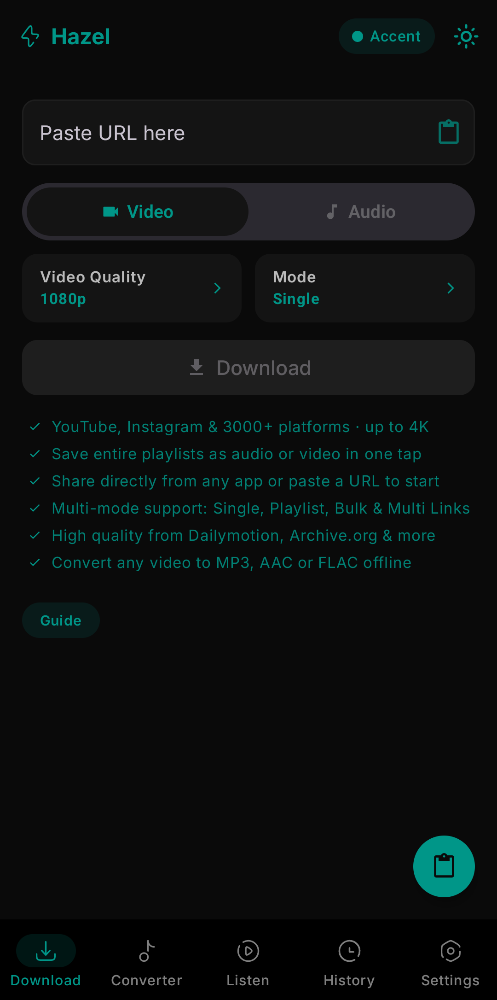
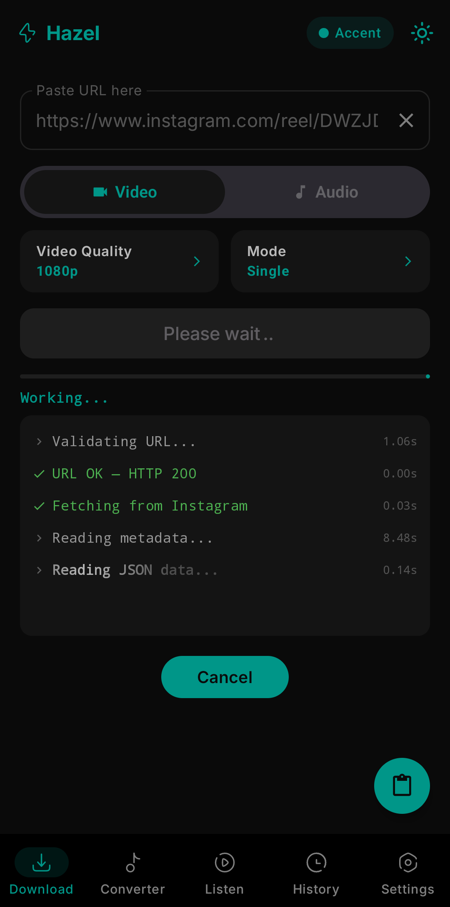

# Hazel

Hazel is a media downloader and converter for Android. Download videos and audio from 3000+ platforms and convert between formats offline — all from one app.

## What Makes Hazel Different

- **Share & Download** — See a reel, tweet, or story? Just tap _Share → Hazel_ and it downloads automatically. No copy-pasting URLs.
- **The Source's Own Formats** — No fixed quality presets. Hazel reads what the site actually serves and lets you pick from it, right down to the codec and file size.
- **Offline Converter** — Already have a video file? Convert it to any audio format right on your device, no internet needed.
- **Self-Updating Engine** — Update yt-dlp straight from its GitHub releases, independently of the app, so extractor fixes land the day they ship.

## Screenshots

  
  

## Features

### Download
- **3000+ Platforms** — YouTube, Instagram, Twitter/X, TikTok, SoundCloud, Vimeo, Dailymotion, and more
- **Real Formats, Not Presets** — Pick from the formats the source actually offers, with container, codec, size and bitrate shown for each. Best is always first.
- **Works on Sparse Sources** — Sites that report little or no metadata still resolve, and a generic best option keeps the download possible either way
- **Share to Download** — Share any URL from any app to start downloading instantly
- **Live Progress** — Percentage, transferred size and a progress ring on the media card itself
- **Smart Notifications** — Real-time progress bar and completion alerts

### Converter (More > Tools)
- **Offline Conversion** — Convert any downloaded video to MP3, AAC, or FLAC without internet
- **Batch Support** — Convert multiple files at once
- **Quality Control** — Choose bitrate and format before converting

### Engine Updates
- **Independent yt-dlp Updates** — Pull the latest yt-dlp binary from GitHub without reinstalling Hazel
- **Release Channels** — Choose between Stable, Nightly, and Master builds
- **Automatic Refresh** — The selected channel is checked on launch and can be updated on demand from More

### Customization
- **12+ Accent Colors** 
- **Light & Dark Theme** 

## Installation

Download the latest APK from [GitHub Releases](https://github.com/SibtainOcn/Hazel/releases).

The debug APK will be at `app/build/outputs/apk/debug/`.

For release builds, you'll need to configure your own signing key — see the [Contributing Guide](CONTRIBUTING.md).

## Contributing

We welcome contributions! Please read our [Contributing Guide](CONTRIBUTING.md) before submitting a pull request.

## License

GPL-3.0 License — see [LICENSE](LICENSE) for details.

