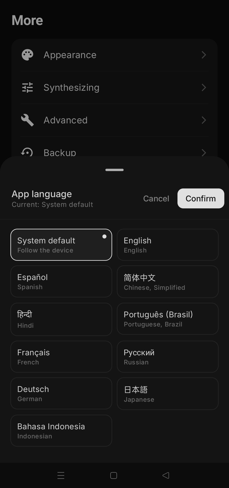
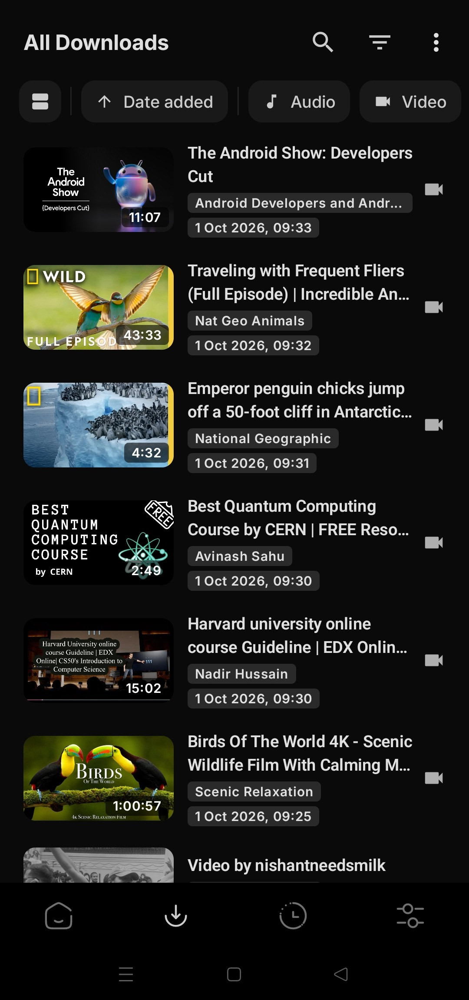
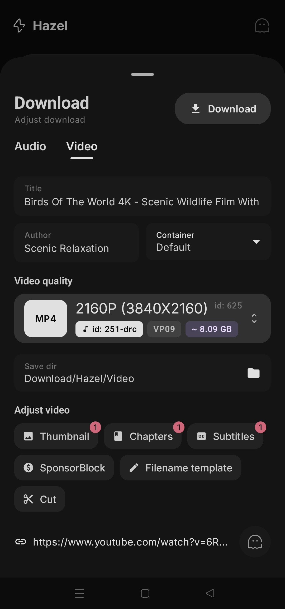
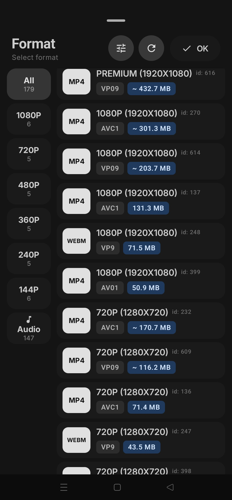
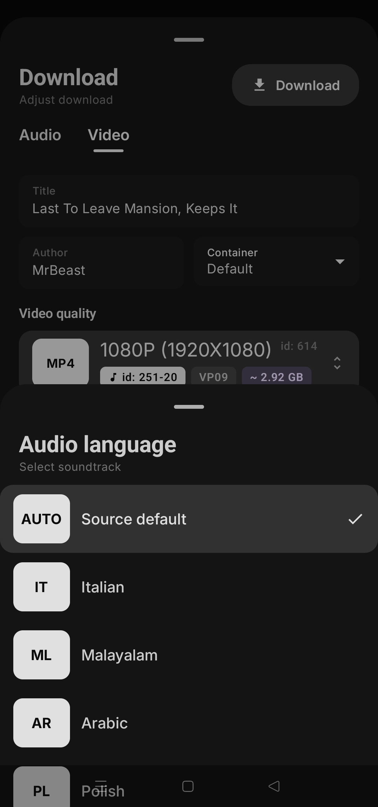
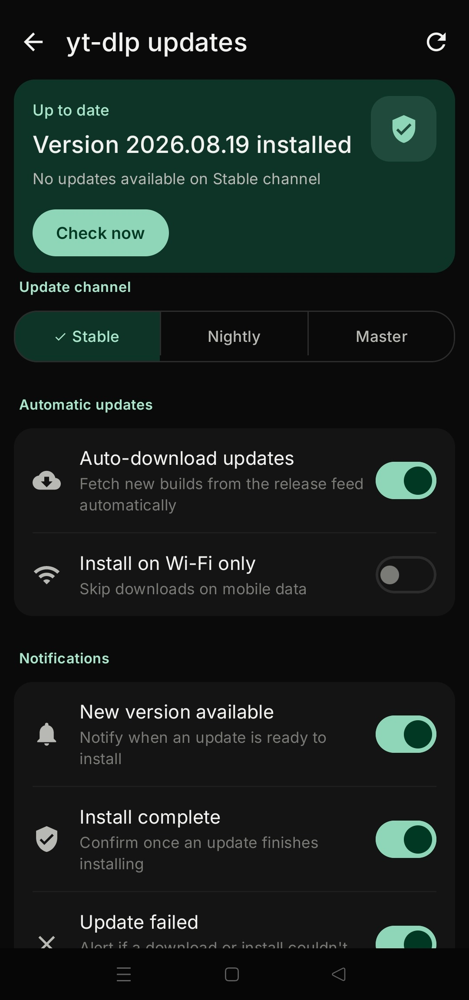
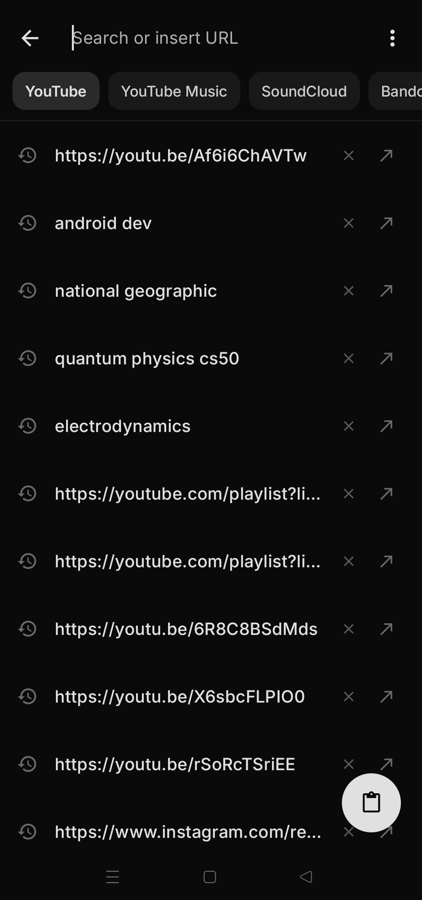
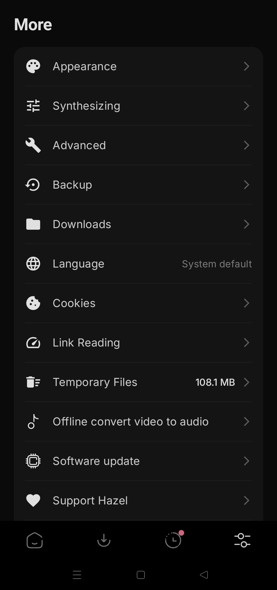

<p align="center">
  
</p>

<div align="center">
<a href="../../README.md">English</a>
&nbsp;&nbsp;| &nbsp;&nbsp;
Español
&nbsp;&nbsp;| &nbsp;&nbsp;
<a href="README-zh_Hans.md">简体中文</a>
&nbsp;&nbsp;| &nbsp;&nbsp;
<a href="README-zh_Hant.md">繁體中文</a>
&nbsp;&nbsp;| &nbsp;&nbsp;
<a href="README-ar.md">العربية</a>
&nbsp;&nbsp;| &nbsp;&nbsp;
<a href="README-pt_BR.md">Português (Brasil)</a>
&nbsp;&nbsp;| &nbsp;&nbsp;
<a href="README-fr.md">Français</a>
&nbsp;&nbsp;| &nbsp;&nbsp;
<a href="README-de.md">Deutsch</a>
&nbsp;&nbsp;| &nbsp;&nbsp;
<a href="README-ru.md">Русский</a>
&nbsp;&nbsp;| &nbsp;&nbsp;
<a href="README-ja.md">日本語</a>
&nbsp;&nbsp;| &nbsp;&nbsp;
<a href="README-id.md">Bahasa Indonesia</a>
&nbsp;&nbsp;| &nbsp;&nbsp;
<a href="README-hi.md">हिंदी</a>
&nbsp;&nbsp;| &nbsp;&nbsp;
<a href="README-ur.md">اردو</a>
&nbsp;&nbsp;| &nbsp;&nbsp;
<a href="README-uk.md">Українська</a>
&nbsp;&nbsp;| &nbsp;&nbsp;
<a href="README-th.md">ภาษาไทย</a>
&nbsp;&nbsp;| &nbsp;&nbsp;
<a href="README-fa.md">فارسی</a>
&nbsp;&nbsp;| &nbsp;&nbsp;
<a href="README-it.md">Italiano</a>
&nbsp;&nbsp;| &nbsp;&nbsp;
<a href="README-az.md">Azərbaycanca</a>
&nbsp;&nbsp;| &nbsp;&nbsp;
<a href="README-sr.md">Српски</a>
</div>
<br> <!-- Adds vertical space here -->
<div align="center">

[](https://github.com/SibtainOcn/Hazel/releases/latest)
[](https://github.com/SibtainOcn/Hazel/releases/latest)
[](https://f-droid.org/packages/com.hazel.android/)
<a href="https://www.buymeacoffee.com/sibtainocean"></a>


[](https://github.com/SibtainOcn/Hazel/blob/main/LICENSE)
[](https://github.com/SibtainOcn/Hazel/actions/workflows/ci.yml)
[](https://github.com/SibtainOcn/Hazel/releases/latest)
[](https://github.com/SibtainOcn/Hazel/blob/main/CHANGELOG.md)
[](https://github.com/SibtainOcn/Hazel/releases)
[](https://github.com/yt-dlp/yt-dlp/blob/master/supportedsites.md)
[](https://github.com/SibtainOcn/Hazel/stargazers)

</div>

*Solo los enlaces indicados arriba ([GitHub Releases](https://github.com/SibtainOcn/Hazel/releases/latest) y [F-Droid](https://f-droid.org/packages/com.hazel.android/)) son las fuentes oficiales y de confianza de Hazel. Cualquier sitio web externo o vendedor de terceros no es oficial y opera de forma totalmente independiente de mí.*

## 📲 Capturas de pantalla

<div>












</div>

## 💡 Funciones:

- Descarga audio y vídeo de YouTube, Instagram, TikTok, X, Reddit, SoundCloud y [más de 1000 sitios](https://github.com/yt-dlp/yt-dlp/blob/master/supportedsites.md)
- Pega un enlace, varios a la vez o una lista de reproducción / canal completo con descarga por lotes en un clic
- **Hazel Instant** - comparte un enlace desde cualquier otra app y la descarga empieza al instante con la calidad que configuraste una vez
- Elige pistas de audio concretas cuando la fuente publica varias
- Edita el título, el autor y el tipo de archivo / metadatos antes de guardar
- Selecciona distintos formatos y contenedores de descarga

### Buscar y reproducir
- **Búsqueda** - escribe palabras en lugar de un enlace para buscar en YouTube, YouTube Music, SoundCloud, Bandcamp, Bilibili, Niconico, PRX o Rokfin, con sugerencias de búsqueda opcionales
- **Reproduce antes de descargar** - reproduce cualquier resultado o enlace en su propia tarjeta, con barra de progreso, doble toque para saltar, pantalla completa y selector de calidad, en cualquier sitio que Hazel pueda leer
- **Recortar** - descarga solo una parte de un vídeo o pista, eligiendo el rango sobre una vista previa en directo
- **Directos** - graba desde el inicio de una transmisión en directo, o espera a un estreno y descárgalo después

### Procesamiento
- **Selección de idioma** - guarda en cualquier idioma que ofrezca el vídeo original
- **SponsorBlock** - elimina patrocinios, intros y otros segmentos
- **Capítulos** - incrústalos en el archivo o divídelo en un archivo por capítulo
- **Subtítulos** - en los idiomas que elijas

### Descargas
- Descargas en segundo plano de larga duración
- Pausa, reanuda y cancela desde la tarjeta o la notificación
- Modo solo Wi-Fi - se comprueba al empezar, así una transferencia en curso no se corta
- Sin límite de velocidad por defecto, con fragmentos en paralelo y un límite de velocidad opcional
- Los resultados que aún no has descargado permanecen en la pantalla de inicio hasta que los borres

### Privacidad
- **Incógnito** - las descargas no se añaden a tu biblioteca y los enlaces no se recuerdan
- Sin cuentas, sin analíticas, no se envía nada a ningún sitio (las sugerencias de búsqueda, desactivadas por defecto, envían lo que escribes a Google)

### Ajustes y personalización
- Temas oscuro y claro con color de acento
- Idiomas de la app - inglés, español, hindi, chino simplificado, portugués de Brasil, francés, alemán, ruso, japonés, indonesio y el predeterminado del sistema
- Actualizaciones independientes del motor yt-dlp - canal Stable, Nightly o Master
- Conversor de vídeo a audio sin conexión
- **Copia de seguridad y restauración** - ajustes, lista de descargas, cola, cookies e historial de búsqueda


---
## ⬇️ Descarga

Para la mayoría de dispositivos se recomienda instalar la versión **arm64-v8a** de los APK

- Descarga la última versión estable desde [GitHub releases](https://github.com/SibtainOcn/Hazel/releases/latest)
  - Instala las versiones [preliminares](https://github.com/SibtainOcn/Hazel/releases/) para ayudarnos a probar nuevas funciones y cambios

- Las versiones estables también están disponibles en [F-Droid](https://f-droid.org/packages/com.hazel.android/)

Hazel siempre será gratuito y de código abierto para todos. Si te gusta, considera apoyar el proyecto mediante [GitHub Sponsors](https://github.com/sponsors/SibtainOcn) o [Buy Me a Coffee](https://www.buymeacoffee.com/sibtainocean).

### 🔗  Conectar con apps de terceros
El nombre de paquete de la app es `com.hazel.android`.

### ✅ Verificar la firma de la aplicación
Las compilaciones de Hazel son reproducibles. Las versiones oficiales están firmadas con el certificado del desarrollador que aparece abajo. Si la firma de tu APK es distinta, un tercero ha modificado la aplicación. Verifica siempre que usas la app con la firma original:

```text
Owner (DN): CN=sibtainocn
SHA-256:    0377e9c8352c017e42583cea1715c40c400a51c4045c268825ffc9bae1305c86
SHA-1:      d5c4a6a86d3cde1c1c722564f1efaf8893ea85a2
MD5:        3bcce9e14c616a9087766563875978e6
```

## 🤝 Contribuir

¡Las contribuciones son bienvenidas!

> [!Note]
>
> Para enviar informes de errores, solicitudes de funciones, preguntas o cualquier otra idea de mejora, lee primero [CONTRIBUTING.md](https://github.com/SibtainOcn/Hazel/blob/main/CONTRIBUTING.md) para conocer las instrucciones y pautas.

## 📄 Licencia

[GNU GPL v3.0 or later](https://github.com/SibtainOcn/Hazel/blob/main/LICENSE) &nbsp;·&nbsp; `SPDX-License-Identifier: GPL-3.0-or-later`

Copyright (C) 2026 SibtainOcn

Hazel is free software: you can redistribute it and/or modify it under the terms of the GNU General Public License as published by the Free Software Foundation, either version 3 of the License, or (at your option) any later version.

Hazel is distributed in the hope that it will be useful, but WITHOUT ANY WARRANTY; without even the implied warranty of MERCHANTABILITY or FITNESS FOR A PARTICULAR PURPOSE. See the GNU General Public License for more details.

You should have received a copy of the GNU General Public License along with Hazel. If not, see <https://www.gnu.org/licenses/>.

> [!Warning]
>
> Salvo el código fuente licenciado bajo GPLv3, se prohíbe a cualquier otra parte usar el nombre de Hazel para una app de descargas, y lo mismo aplica a los derivados de Hazel. Los derivados incluyen, entre otros, forks y compilaciones no oficiales.

## 🧱 Créditos

Hazel es una interfaz gráfica para [yt-dlp](https://github.com/yt-dlp/yt-dlp), basada en [youtubedl-android](https://github.com/yausername/youtubedl-android).
[NewPipeExtractor](https://github.com/TeamNewPipe/NewPipeExtractor) para listados, búsqueda y streams de reproducción rápidos, y [Media3 ExoPlayer](https://github.com/androidx/media) para la reproducción.

> *Un agradecimiento especial al equipo de [yt-dlp](https://github.com/yt-dlp/yt-dlp): sin su trabajo, Hazel no existiría.*
>
<div align="right">
<table><td>
<a href="#start-of-content">👆 Volver arriba</a>
</td></table>
</div>
