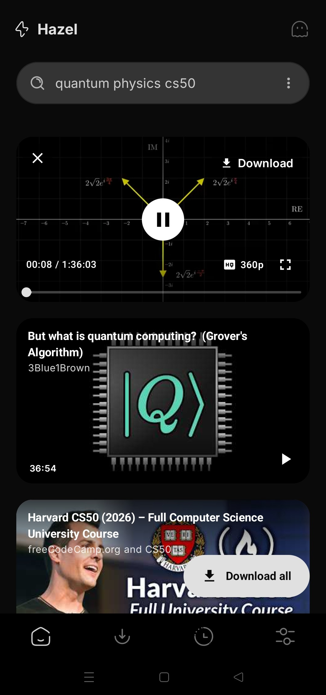
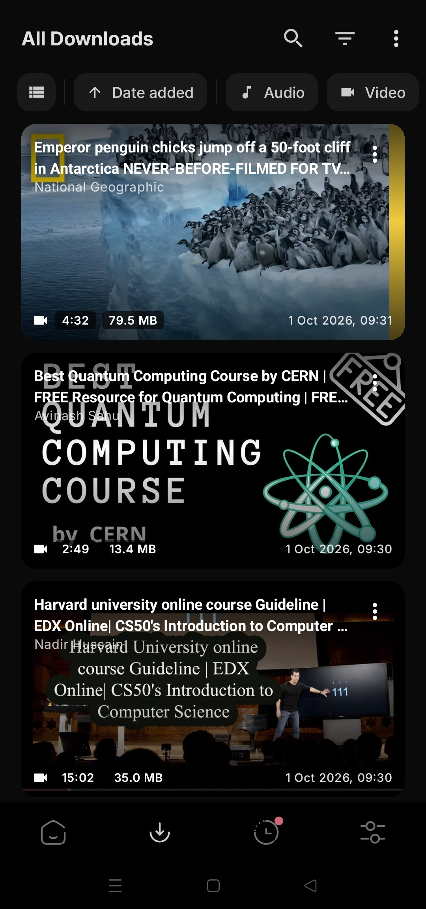
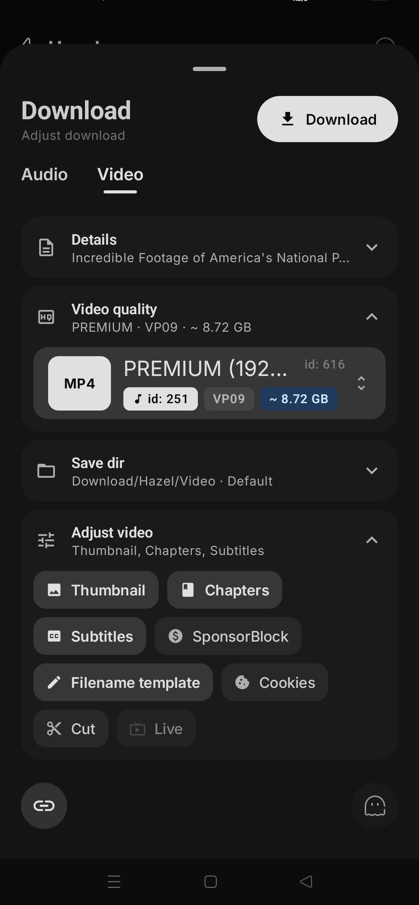
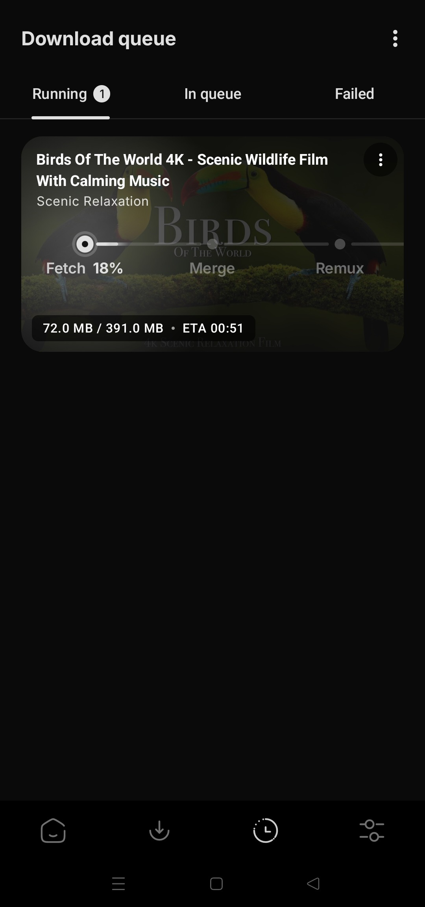
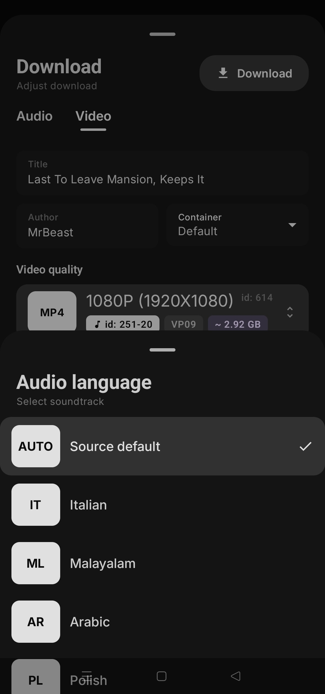
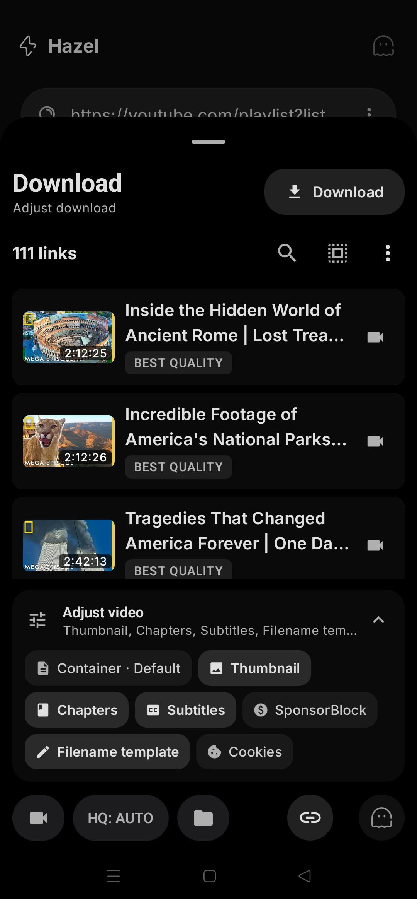
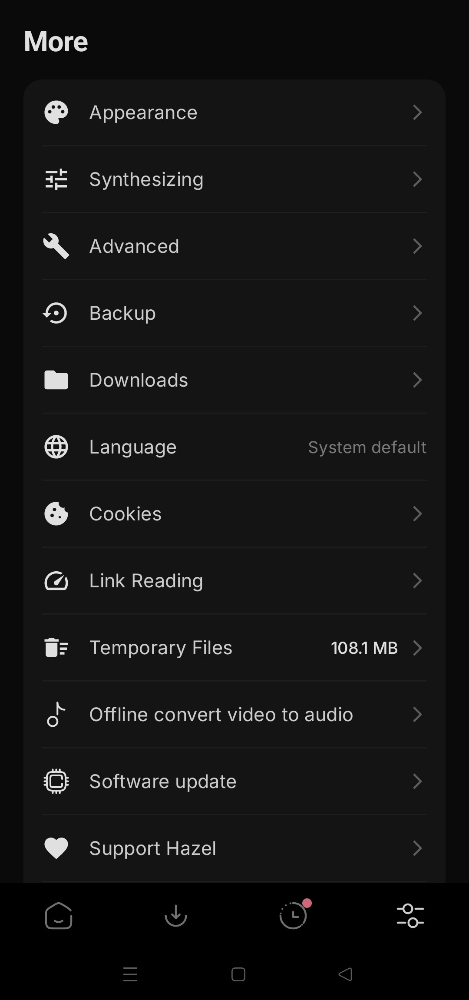

<p align="center">
  
</p>

<div align="center">
<a href="../../README.md">English</a>
&nbsp;&nbsp;| &nbsp;&nbsp;
<a href="README-es.md">Español</a>
&nbsp;&nbsp;| &nbsp;&nbsp;
<a href="README-zh_Hans.md">简体中文</a>
&nbsp;&nbsp;| &nbsp;&nbsp;
<a href="README-zh_Hant.md">繁體中文</a>
&nbsp;&nbsp;| &nbsp;&nbsp;
<a href="README-ar.md">العربية</a>
&nbsp;&nbsp;| &nbsp;&nbsp;
<a href="README-pt_BR.md">Português (Brasil)</a>
&nbsp;&nbsp;| &nbsp;&nbsp;
<a href="README-fr.md">Français</a>
&nbsp;&nbsp;| &nbsp;&nbsp;
<a href="README-de.md">Deutsch</a>
&nbsp;&nbsp;| &nbsp;&nbsp;
<a href="README-ru.md">Русский</a>
&nbsp;&nbsp;| &nbsp;&nbsp;
日本語
&nbsp;&nbsp;| &nbsp;&nbsp;
<a href="README-id.md">Bahasa Indonesia</a>
&nbsp;&nbsp;| &nbsp;&nbsp;
<a href="README-hi.md">हिंदी</a>
&nbsp;&nbsp;| &nbsp;&nbsp;
<a href="README-ur.md">اردو</a>
&nbsp;&nbsp;| &nbsp;&nbsp;
<a href="README-uk.md">Українська</a>
&nbsp;&nbsp;| &nbsp;&nbsp;
<a href="README-th.md">ภาษาไทย</a>
&nbsp;&nbsp;| &nbsp;&nbsp;
<a href="README-fa.md">فارسی</a>
&nbsp;&nbsp;| &nbsp;&nbsp;
<a href="README-it.md">Italiano</a>
&nbsp;&nbsp;| &nbsp;&nbsp;
<a href="README-az.md">Azərbaycanca</a>
&nbsp;&nbsp;| &nbsp;&nbsp;
<a href="README-sr.md">Српски</a>
</div>
<br> <!-- Adds vertical space here -->
<div align="center">

[](https://github.com/SibtainOcn/Hazel/releases/latest)
[](https://github.com/SibtainOcn/Hazel/releases/latest)
[](https://f-droid.org/packages/com.hazel.android/)
<a href="https://www.buymeacoffee.com/sibtainocean"></a>


[](https://github.com/SibtainOcn/Hazel/blob/main/LICENSE)
[](https://github.com/SibtainOcn/Hazel/actions/workflows/ci.yml)
[](https://github.com/SibtainOcn/Hazel/releases/latest)
[](https://github.com/SibtainOcn/Hazel/blob/main/CHANGELOG.md)
[](https://github.com/SibtainOcn/Hazel/releases)
[](https://github.com/yt-dlp/yt-dlp/blob/master/supportedsites.md)
[](https://github.com/SibtainOcn/Hazel/stargazers)

</div>

*上記のリンク（[GitHub Releases](https://github.com/SibtainOcn/Hazel/releases/latest) と [F-Droid](https://f-droid.org/packages/com.hazel.android/)）のみが Hazel の公式かつ信頼できる配布元です。外部のウェブサイトやサードパーティの販売者はすべて非公式であり、私とはまったく無関係に運営されていることにご注意ください。*

## 📲 スクリーンショット

<div>












</div>

## 💡 機能：

- YouTube、Instagram、TikTok、X、Reddit、SoundCloud など [1000 以上のサイト](https://github.com/yt-dlp/yt-dlp/blob/master/supportedsites.md) から音声と動画をダウンロード
- リンクを 1 つ、複数まとめて、またはプレイリスト / チャンネル全体を貼り付けて、ワンクリックで一括ダウンロード
- **Hazel Instant** - 他のアプリからリンクを共有するだけで、一度設定した画質ですぐにダウンロードが始まります
- ソースが複数の音声トラックを公開している場合は、特定のトラックを選択可能
- 保存前にタイトル、作者、ファイル形式 / メタデータを編集
- さまざまなダウンロード形式とコンテナを選択

### 検索と再生
- **検索** - リンクの代わりにキーワードを入力して YouTube、YouTube Music、SoundCloud、Bandcamp、Bilibili、ニコニコ、PRX、Rokfin を検索（検索候補は任意）
- **ダウンロード前に再生** - 検索結果やリンクをカード上でそのまま再生。シークバー、ダブルタップでスキップ、全画面表示、画質選択に対応し、Hazel が読み込めるあらゆるサイトで使えます
- **カット** - 動画やトラックの一部だけをダウンロード。範囲はライブプレビューで選択
- **ライブ配信** - 配信を最初から録画、またはプレミア公開を待ってからダウンロード

### 処理
- **言語の選択** - 元の動画が提供する任意の言語で保存
- **SponsorBlock** - スポンサー、イントロなどの区間をカット
- **チャプター** - ファイルに埋め込むか、チャプターごとに別ファイルに分割
- **字幕** - 選んだ言語で

### ダウンロード
- 長時間のバックグラウンドダウンロードに対応
- カードまたは通知から一時停止・再開・キャンセル
- Wi-Fi 限定モード - 開始時に確認するため、進行中の転送は中断されません
- デフォルトで速度制限なし。並列フラグメントと任意の速度上限に対応
- まだダウンロードしていない結果は、消去するまでホーム画面に残ります

### プライバシー
- **シークレットモード** - ダウンロードはライブラリに追加されず、リンクも記録されません
- アカウント不要、解析なし、どこにも何も送信しません（検索候補はデフォルトでオフ。オンにすると入力内容が Google に送信されます）

### 設定とカスタマイズ
- アクセントカラー付きのダークテーマとライトテーマ
- アプリの言語 - 英語、スペイン語、ヒンディー語、簡体字中国語、ブラジルポルトガル語、フランス語、ドイツ語、ロシア語、日本語、インドネシア語、システムの既定
- yt-dlp エンジンの独立したアップデート - Stable、Nightly、Master チャンネル
- オフラインの動画→音声変換
- **バックアップと復元** - 設定、ダウンロード一覧、キュー、Cookie、検索履歴


---
## ⬇️ ダウンロード

ほとんどの端末では、**arm64-v8a** 版の APK のインストールをおすすめします

- 最新の安定版は [GitHub releases](https://github.com/SibtainOcn/Hazel/releases/latest) からダウンロード
  - [プレリリース](https://github.com/SibtainOcn/Hazel/releases/) 版をインストールして、新機能や変更のテストにご協力ください

- 安定版は [F-Droid](https://f-droid.org/packages/com.hazel.android/) でも入手できます

Hazel はこれからもずっと、誰でも無料で使えるオープンソースです。気に入ったら、[GitHub Sponsors](https://github.com/sponsors/SibtainOcn) または [Buy Me a Coffee](https://www.buymeacoffee.com/sibtainocean) でプロジェクトの支援をご検討ください！

### 🔗  サードパーティアプリとの連携
アプリのパッケージ名は `com.hazel.android` です。

### ✅ アプリの署名を確認する
Hazel のリリースビルドは再現可能です。公式リリースは以下の開発者証明書で署名されています。お使いの APK の署名が異なる場合、第三者によってアプリが改変されています。必ずオリジナルの署名のアプリを使っていることを確認してください：

```text
Owner (DN): CN=sibtainocn
SHA-256:    0377e9c8352c017e42583cea1715c40c400a51c4045c268825ffc9bae1305c86
SHA-1:      d5c4a6a86d3cde1c1c722564f1efaf8893ea85a2
MD5:        3bcce9e14c616a9087766563875978e6
```

## 🤝 コントリビュート

コントリビューションを歓迎します！

> [!Note]
>
> バグ報告、機能リクエスト、質問、その他の改善アイデアを送る前に、まず [CONTRIBUTING.md](https://github.com/SibtainOcn/Hazel/blob/main/CONTRIBUTING.md) の手順とガイドラインをお読みください。

## 📄 ライセンス

[GNU GPL v3.0 or later](https://github.com/SibtainOcn/Hazel/blob/main/LICENSE) &nbsp;·&nbsp; `SPDX-License-Identifier: GPL-3.0-or-later`

Copyright (C) 2026 SibtainOcn

Hazel is free software: you can redistribute it and/or modify it under the terms of the GNU General Public License as published by the Free Software Foundation, either version 3 of the License, or (at your option) any later version.

Hazel is distributed in the hope that it will be useful, but WITHOUT ANY WARRANTY; without even the implied warranty of MERCHANTABILITY or FITNESS FOR A PARTICULAR PURPOSE. See the GNU General Public License for more details.

You should have received a copy of the GNU General Public License along with Hazel. If not, see <https://www.gnu.org/licenses/>.

> [!Warning]
>
> GPLv3 ライセンスで提供されるソースコードを除き、Hazel の名前をダウンローダーアプリとして使用することは他のすべての者に禁止されており、Hazel の派生物にも同様に適用されます。派生物にはフォークや非公式ビルドなどが含まれますが、これらに限りません。

## 🧱 クレジット

Hazel は [yt-dlp](https://github.com/yt-dlp/yt-dlp) の GUI であり、[youtubedl-android](https://github.com/yausername/youtubedl-android) をベースにしています。
高速なリスト表示・検索・再生ストリームには [NewPipeExtractor](https://github.com/TeamNewPipe/NewPipeExtractor) を、再生には [Media3 ExoPlayer](https://github.com/androidx/media) を使用しています。

> *[yt-dlp](https://github.com/yt-dlp/yt-dlp) チームに特別な感謝を - 彼らの成果がなければ Hazel は存在しませんでした。*
>
<div align="right">
<table><td>
<a href="#start-of-content">👆 トップへ戻る</a>
</td></table>
</div>
