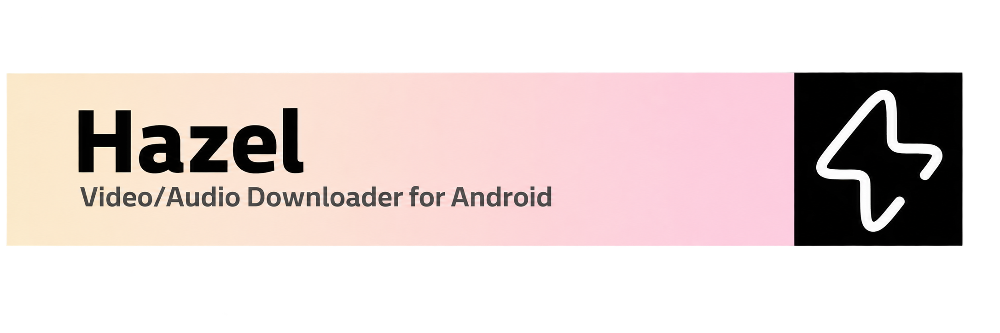
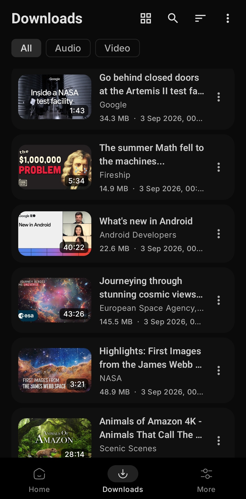

  

<a href="../../README.md">English</a>
&nbsp;&nbsp;| &nbsp;&nbsp;
<a href="README-es.md">Español</a>
&nbsp;&nbsp;| &nbsp;&nbsp;
<a href="README-zh_Hans.md">简体中文</a>
&nbsp;&nbsp;| &nbsp;&nbsp;
<a href="README-zh_Hant.md">繁體中文</a>
&nbsp;&nbsp;| &nbsp;&nbsp;
<a href="README-ar.md">العربية</a>
&nbsp;&nbsp;| &nbsp;&nbsp;
<a href="README-pt_BR.md">Português (Brasil)</a>
&nbsp;&nbsp;| &nbsp;&nbsp;
<a href="README-fr.md">Français</a>
&nbsp;&nbsp;| &nbsp;&nbsp;
<a href="README-de.md">Deutsch</a>
&nbsp;&nbsp;| &nbsp;&nbsp;
<a href="README-ru.md">Русский</a>
&nbsp;&nbsp;| &nbsp;&nbsp;
<a href="README-ja.md">日本語</a>
&nbsp;&nbsp;| &nbsp;&nbsp;
<a href="README-id.md">Bahasa Indonesia</a>
&nbsp;&nbsp;| &nbsp;&nbsp;
<a href="README-hi.md">हिंदी</a>
&nbsp;&nbsp;| &nbsp;&nbsp;
<a href="README-ur.md">اردو</a>
&nbsp;&nbsp;| &nbsp;&nbsp;
<a href="README-uk.md">Українська</a>
&nbsp;&nbsp;| &nbsp;&nbsp;
<a href="README-th.md">ภาษาไทย</a>
&nbsp;&nbsp;| &nbsp;&nbsp;
<a href="README-fa.md">فارسی</a>
&nbsp;&nbsp;| &nbsp;&nbsp;
<a href="README-it.md">Italiano</a>
&nbsp;&nbsp;| &nbsp;&nbsp;
<a href="README-az.md">Azərbaycanca</a>
&nbsp;&nbsp;| &nbsp;&nbsp;
Српски

## 📲 Screenshots

## 💡 Карактеристике:

- Преузимајте аудио и видео са платформи YouTube, Instagram, TikTok, X, Reddit, SoundCloud и [преко 1000 других сајтова](https://github.com/yt-dlp/yt-dlp/blob/master/supportedsites.md)
- Убаците један линк, више њих истовремено или комплетну плејлисту / канал уз групно преузимање једним кликом
- **Hazel Instant** - поделите линк из било које апликације и преузимање одмах почиње у задатом квалитету
- Одаберите жељену аудио траку када видео извор нуди више језика
- Уредите наслов, аутора и формат фајла / метаподатке пре чувања
- Одаберите различите формате и контејнере за преузимање

### Обрада медија
- **Избор језика** - сачувајте на било ком језику који оригинални видео садржи (српски, енглески, руски, немачки итд.)
- **SponsorBlock** - аутоматски исеците спонзорисане сегменте, уводе и нежељене делове
- **Поглавља (Chapters)** - уградите у фајл или поделите у засебне фајлове по поглављима
- **Титлови** - уградите у видео, сачувајте засебно или оба на одабраним језицима

### Преузимања
- Подршка за дуготрајно преузимање у позадини путем сервиса у првом плану
- Паузирајте, наставите и откажите преузимање са картице или обавештења
- Режим само преко Wi-Fi мреже - проверава се на почетку да не би дошло до прекида

### Приватност
- **Режим инкогнито** - преузимања се не додају у историју, а линкови се не памте
- Без налога, без аналитике, ништа се не шаље трећим лицима

### Подешавања и прилагођавање
- Тамна и светла тема са избором акцентне боје
- Језици апликације - српски, енглески, руски, немачки, шпански, француски и подразумевани системски
- Независна ажурирања yt-dlp мотора - Stable, Nightly или Master канали
- Офлајн конвертор видеа у аудио

---
## ⬇️ Преузимање

За већину уређаја препоручује се инсталација **arm64-v8a** верзије АПК-а

- Преузмите најновију стабилну верзију са странице [GitHub Releases](https://github.com/SibtainOcn/Hazel/releases/latest)
  - Инсталирајте [верзије пре званичног издања](https://github.com/SibtainOcn/Hazel/releases/) како бисте помогли у тестирању

- Стабилна издања су такође доступна на платформи [F-Droid](https://f-droid.org/packages/com.hazel.android/)

Hazel ће увек бити бесплатан и отвореног кода за све. Ако вам се допада, размислите о [подршци пројекту](https://github.com/sponsors/SibtainOcn)!

## 🤝 Допринос

Сви доприноси су добродошли!

> [!Note]
>
> Пре слања пријава грешака или предлога, молимо прочитајте смернице у [CONTRIBUTING.md](https://github.com/SibtainOcn/Hazel/blob/main/CONTRIBUTING.md).

## 📄 Лиценца

[GNU GPL v3.0](https://github.com/SibtainOcn/Hazel/blob/main/LICENSE)

> [!Warning]
>
> Осим изворног кода под GPLv3 лиценцом, свим осталим странама је забрањено коришћење имена Hazel за апликације за преузимање, као и за деривате.

## 🧱 Заслуге

Hazel је графички интерфејс за [yt-dlp](https://github.com/yt-dlp/yt-dlp), заснован на [youtubedl-android](https://github.com/yausername/youtubedl-android).
[NewPipeExtractor](https://github.com/TeamNewPipe/NewPipeExtractor)

<table><td>
<a href="#start-of-content">👆 Повратак на врх</a>
</td></table>

