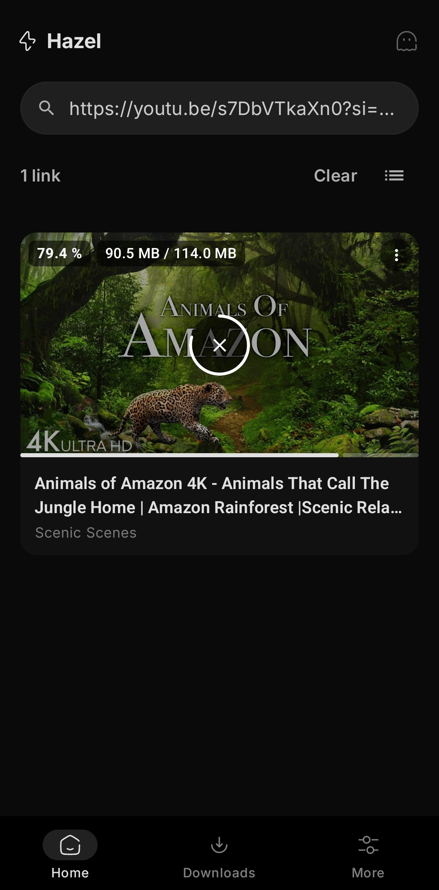
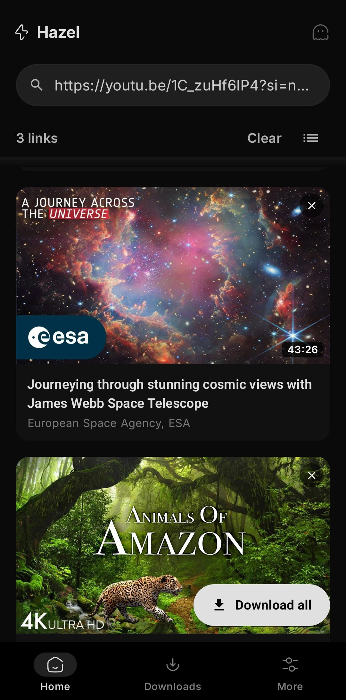
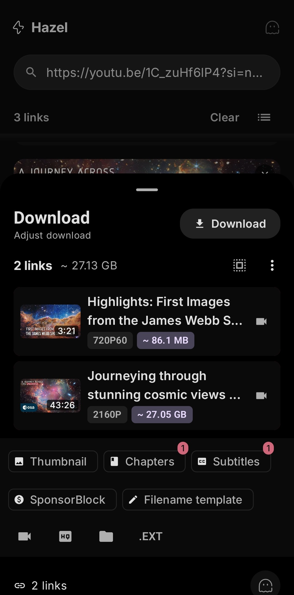
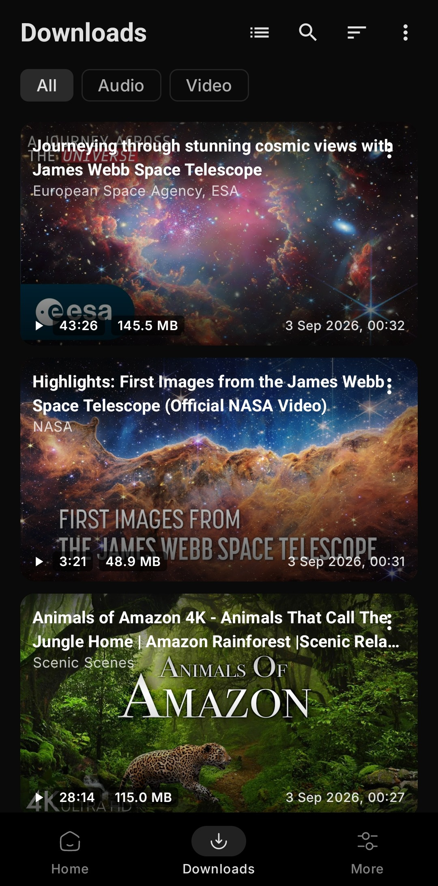
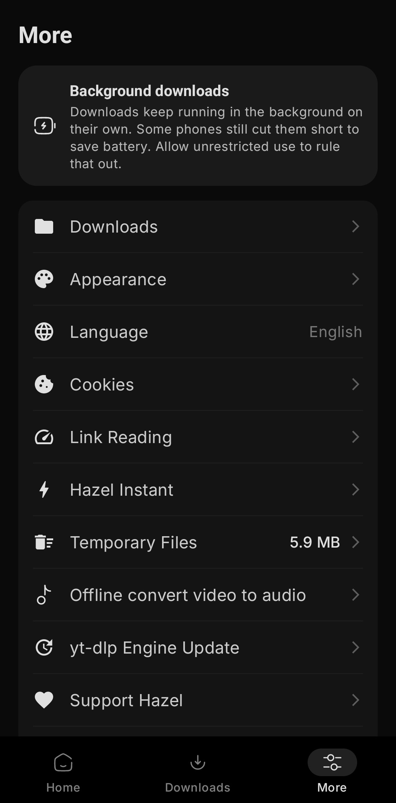
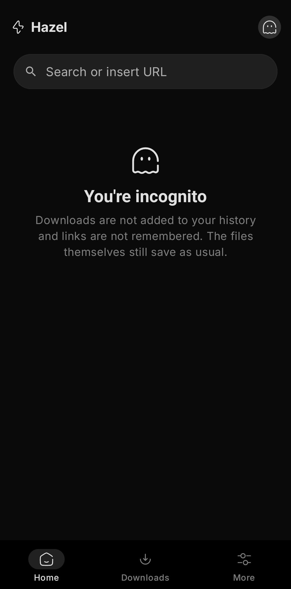
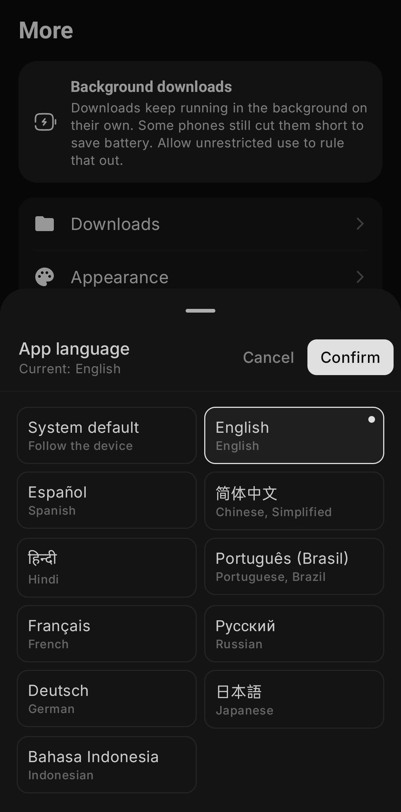

  

<a href="../../README.md">English</a>
&nbsp;&nbsp;| &nbsp;&nbsp;
<a href="README-es.md">Español</a>
&nbsp;&nbsp;| &nbsp;&nbsp;
<a href="README-zh_Hans.md">简体中文</a>
&nbsp;&nbsp;| &nbsp;&nbsp;
<a href="README-zh_Hant.md">繁體中文</a>
&nbsp;&nbsp;| &nbsp;&nbsp;
<a href="README-ar.md">العربية</a>
&nbsp;&nbsp;| &nbsp;&nbsp;
<a href="README-pt_BR.md">Português (Brasil)</a>
&nbsp;&nbsp;| &nbsp;&nbsp;
<a href="README-fr.md">Français</a>
&nbsp;&nbsp;| &nbsp;&nbsp;
<a href="README-de.md">Deutsch</a>
&nbsp;&nbsp;| &nbsp;&nbsp;
<a href="README-ru.md">Русский</a>
&nbsp;&nbsp;| &nbsp;&nbsp;
<a href="README-ja.md">日本語</a>
&nbsp;&nbsp;| &nbsp;&nbsp;
<a href="README-id.md">Bahasa Indonesia</a>
&nbsp;&nbsp;| &nbsp;&nbsp;
<a href="README-hi.md">हिंदी</a>
&nbsp;&nbsp;| &nbsp;&nbsp;
اردو
&nbsp;&nbsp;| &nbsp;&nbsp;
<a href="README-uk.md">Українська</a>
&nbsp;&nbsp;| &nbsp;&nbsp;
<a href="README-th.md">ภาษาไทย</a>
&nbsp;&nbsp;| &nbsp;&nbsp;
<a href="README-fa.md">فارسی</a>
&nbsp;&nbsp;| &nbsp;&nbsp;
<a href="README-it.md">Italiano</a>
&nbsp;&nbsp;| &nbsp;&nbsp;
<a href="README-az.md">Azərbaycanca</a>
&nbsp;&nbsp;| &nbsp;&nbsp;
<a href="README-sr.md">Српски</a>

## 📲 Screenshots

## 💡 خصوصیات:

- یوٹیوب، انسٹاگرام، ٹک ٹاک، ایکس، ریڈٹ، ساؤنڈ کلاؤڈ اور [1000 سے زائد ویب سائٹس](https://github.com/yt-dlp/yt-dlp/blob/master/supportedsites.md) سے آڈیو اور ویڈیو ڈاؤن لوڈ کریں
- ایک لنک، بیک وقت کئی لنکس یا پوری پلے لسٹ / چینل ایک کلک میں ڈاؤن لوڈ کریں
- **Hazel Instant** - کسی بھی ایپ سے لنک شیئر کریں اور ڈاؤن لوڈ فوری طور پر پہلے سے طے شدہ کوالٹی پر شروع ہو جائے گا
- جب ویڈیو میں کئی زبانوں کی آڈیو ہو تو اپنی پسندیدہ آڈیو ٹریک کا انتخاب کریں
- محفوظ کرنے سے پہلے عنوان، مصنف اور فائل فارمیٹ / میٹا ڈیٹا میں ترمیم کریں
- مختلف ویڈیو اور آڈیو ڈاؤن لوڈ فارمیٹس کا انتخاب کریں

### میڈیا پروسیسنگ
- **زبان کا انتخاب** - ماخذ ویڈیو میں دستیاب کسی بھی زبان میں آڈیو محفوظ کریں (اردو، انگریزی، ہندی، عربی، جرمن وغیرہ)
- **SponsorBlock** - اسپانسرز اور غیر ضروری حصوں کو خودکار طور پر خارج کریں
- **ابواب (Chapters)** - فائل میں شامل کریں یا الگ الگ فائلوں میں تقسیم کریں
- **سب ٹائٹلز** - ویڈیو میں شامل کریں یا الگ فائل کے طور پر محفوظ کریں

### ڈاؤن لوڈز
- فورگراؤنڈ سروس کے ساتھ پس منظر (بیک گراؤنڈ) میں ڈاؤن لوڈنگ کی مکمل سہولت
- کارڈ یا نوٹیفکیشن سے ڈاؤن لوڈ کو روکیں، دوبارہ شروع کریں یا منسوخ کریں
- صرف وائی فائی موڈ - پہلے سے جانچ کی جاتی ہے تاکہ جاری ڈاؤن لوڈ میں خلل نہ پڑے

### رازداری
- **پوشیدہ موڈ (Incognito)** - ڈاؤن لوڈز ہسٹری میں شامل نہیں ہوتے اور لنکس محفوظ نہیں کیے جاتے
- کوئی اکاؤنٹ نہیں، کوئی ٹریکنگ نہیں، کوئی ڈیٹا باہر نہیں بھیجا جاتا

### ترتیبات اور کسٹمائزیشن
- ڈارک اور لائٹ تھیمز کے ساتھ ایکسنٹ کلر
- ایپ کی زبانیں - اردو، انگریزی، عربی، ہندی، ہسپانوی، فرانسیسی، جرمن، روسی، جاپانی وغیرہ
- آزادانہ yt-dlp انجن اپ ڈیٹس - Stable، Nightly یا Master چینلز
- آف لائن ویڈیو سے آڈیو کنورٹر

---
## ⬇️ ڈاؤن لوڈ کریں

زیادہ تر ڈیوائسز کے لیے **arm64-v8a** ورژن تجویز کیا جاتا ہے

- تازہ ترین مستحکم ورژن [GitHub Releases](https://github.com/SibtainOcn/Hazel/releases/latest) سے ڈاؤن لوڈ کریں
  - نئی خصوصیات کی جانچ میں مدد کے لیے [پری ریلیز](https://github.com/SibtainOcn/Hazel/releases/) ورژن آزمائیں

- مستحکم ریلیز [F-Droid](https://f-droid.org/packages/com.hazel.android/) پر بھی دستیاب ہیں

Hazel ہمیشہ سب کے لیے مفت اور اوپن سورس رہے گا۔ اگر آپ کو یہ پسند آئے تو براہ کرم [پروجیکٹ کی مدد کریں](https://github.com/sponsors/SibtainOcn)!

## 🤝 تعاون

آپ کے تعاون کا خیرمقدم ہے!

> [!Note]
>
> بگ رپورٹ یا تجاویز بھیجنے سے پہلے براہ کرم [CONTRIBUTING.md](https://github.com/SibtainOcn/Hazel/blob/main/CONTRIBUTING.md) کا مطالعہ کریں۔

## 📄 لائسنس

[GNU GPL v3.0 or later](https://github.com/SibtainOcn/Hazel/blob/main/LICENSE)

> [!Warning]
>
> GPLv3 لائسنس یافتہ سورس کوڈ کے علاوہ، ڈاؤن لوڈر ایپ کے طور پر Hazel کا نام استعمال کرنا منع ہے۔

## 🧱 اعترافات

Hazel دراصل [yt-dlp](https://github.com/yt-dlp/yt-dlp) کا گرافیکل انٹرفیس ہے جو [youtubedl-android](https://github.com/yausername/youtubedl-android) پر مبنی ہے۔
[NewPipeExtractor](https://github.com/TeamNewPipe/NewPipeExtractor)

<table><td>
<a href="#start-of-content">👆 اوپر جائیں</a>
</td></table>

